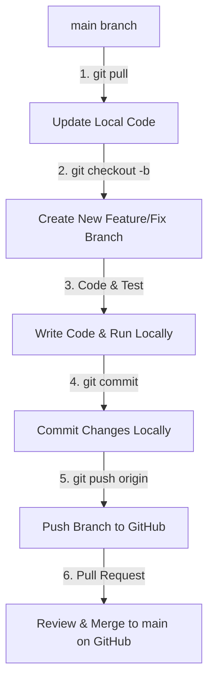

# 🏆 Web Portal Berita Olahraga

[](https://codeigniter.com/)
[](https://www.php.net/)
[](https://getbootstrap.com/)
[](https://www.mysql.com/)

Website Portal Berita Olahraga ini dibangun menggunakan framework **CodeIgniter 3** dengan arsitektur MVC (Model-View-Controller). Platform ini menyajikan informasi terkini seputar dunia olahraga, dilengkapi dengan sistem manajemen konten (CMS) di halaman backend khusus admin untuk mengelola kategori olahraga, liga, klub, artikel berita, dan profil atlet secara dinamis.

---

## 🔗 Akses Cepat (Server Lokal)

Untuk mengakses website di lingkungan server lokal Anda:
*   **Halaman Utama (User/Frontend):** `http://localhost/website-portal-olahraga/`
*   **Halaman Dashboard (Admin/Backend):** `http://localhost/website-portal-olahraga/admin/login`

---

## 👥 Tim Pengembang & Kontributor (Kelas B)

| Peran | NIM | Nama |
| :--- | :--- | :--- |
| **Ketua Kelompok** | `24010110126` | - |
| **Anggota** | `24010110088` | Clara Septia Ramdhani |
| **Anggota** | `24010110076` | Villari Naufal Nety |
| **Anggota** | `24010110078` | M. Syarifudin |

---

## 🚀 Panduan Alur Kerja Git (Git Workflow)

> [!WARNING]
> **ATURAN UTAMA: DILARANG KERAS MELAKUKAN PUSH LANGSUNG KE BRANCH `main`!**
>
> Semua anggota tim **tidak diperbolehkan** mengeksekusi `git push origin main`. Push langsung dapat memicu konflik kode (*merge conflict*) yang rumit dan berpotensi merusak kode stabil di server produksi/repositori utama.

### 🛠️ Alur Kerja Wajib untuk Setiap Fitur/Perbaikan:



1.  **Tarik Kode Terbaru:** Pastikan branch `main` lokal Anda sinkron dengan GitHub sebelum membuat perubahan.
    ```bash
    git checkout main
    git pull origin main
    ```
2.  **Buat Branch Baru:** Gunakan penamaan branch yang deskriptif.
    ```bash
    # Format: feature/nama-fitur atau fix/nama-bug
    git checkout -b feature/tambah-detail-liga
    ```
3.  **Lakukan Perubahan Kode:** Kerjakan tugas Anda pada text editor (misal: VS Code).
4.  **Simpan dan Commit Perubahan:**
    ```bash
    git add .
    git commit -m "feat: menambah halaman detail liga dan daftar klub"
    ```
    *   `feat:` untuk penambahan fitur baru.
    *   `fix:` untuk perbaikan bug/error.
    *   `docs:` untuk pembaruan dokumentasi (README).
    *   `style:` untuk kosmetik kode/tampilan (CSS/HTML layout) tanpa merubah logika.
5.  **Push Branch ke GitHub:**
    ```bash
    git push origin feature/tambah-detail-liga
    ```
6.  **Buat Pull Request (PR):** Buka halaman repositori GitHub, klik **Compare & pull request**, lalu minta anggota tim lain untuk meninjau sebelum digabungkan (*merge*) ke `main`.

---

## 📥 Panduan Instalasi & Setup Pertama Kali

Pilih panduan di bawah ini yang sesuai dengan aplikasi web server lokal yang Anda gunakan di laptop Anda:

### A. Panduan untuk Pengguna Laragon (Direkomendasikan)
1.  **Buka Terminal Git Bash** di direktori web server:
    *   Masuk ke folder `C:\laragon\www\` menggunakan File Explorer.
    *   Klik kanan di area kosong dan pilih **Git Bash Here** (di Windows 11: klik kanan $\rightarrow$ **Show more options** $\rightarrow$ **Git Bash Here**).
2.  **Clone Repositori:**
    ```bash
    git clone https://github.com/[GITHUB_USERNAME]/website-portal-olahraga---codeigniter3.git
    ```
    *(Ganti `[GITHUB_USERNAME]` dengan username pemilik repositori).*
3.  **Sesuaikan Nama Folder:**
    *   Ubah nama folder hasil clone dari `website-portal-olahraga---codeigniter3` menjadi **`website-portal-olahraga`**.
4.  **Jalankan Laragon:** Buka aplikasi Laragon, lalu klik **Start All**.
5.  **Import Database (HeidiSQL):**
    *   Klik tombol **Database** di Laragon untuk membuka HeidiSQL.
    *   Klik **Open** untuk masuk ke session lokal (password default kosong).
    *   Klik kanan pada daftar database sebelah kiri $\rightarrow$ **Create new** $\rightarrow$ **Database** $\rightarrow$ beri nama **`portal_olahraga`**.
    *   Klik database `portal_olahraga` $\rightarrow$ klik menu **File** $\rightarrow$ **Run SQL file...** $\rightarrow$ pilih file `portal_olahraga.sql` yang ada di dalam folder project Anda.
6.  **Akses Web:** `http://localhost/website-portal-olahraga/` atau `http://website-portal-olahraga.test/`.

### B. Panduan untuk Pengguna XAMPP
1.  **Buka Terminal Git Bash** di direktori web server:
    *   Masuk ke folder `C:\xampp\htdocs\` menggunakan File Explorer.
    *   Klik kanan di area kosong dan pilih **Git Bash Here**.
2.  **Clone Repositori:**
    ```bash
    git clone https://github.com/[GITHUB_USERNAME]/website-portal-olahraga---codeigniter3.git
    ```
    *(Ganti `[GITHUB_USERNAME]` dengan username pemilik repositori).*
3.  **Sesuaikan Nama Folder:**
    *   Ubah nama folder hasil clone menjadi **`website-portal-olahraga`**.
4.  **Jalankan XAMPP:** Buka XAMPP Control Panel, lalu klik **Start** pada modul **Apache** dan **MySQL**.
5.  **Import Database (phpMyAdmin):**
    *   Buka browser dan buka alamat `http://localhost/phpmyadmin/`.
    *   Klik **New** di kolom kiri $\rightarrow$ beri nama database **`portal_olahraga`** $\rightarrow$ klik **Create**.
    *   Pilih database `portal_olahraga` $\rightarrow$ klik tab **Import** di bagian atas $\rightarrow$ pilih file `portal_olahraga.sql` dari folder project Anda $\rightarrow$ klik **Import** (Kirim) di bagian bawah.
6.  **Akses Web:** `http://localhost/website-portal-olahraga/`.

---

## 🔧 Konfigurasi Aplikasi Lokal

Setelah instalasi selesai, sesuaikan file konfigurasi berikut agar project berjalan lancar di PC Anda:

1.  **Konfigurasi Koneksi Database:**
    Buka file [application/config/database.php](file:///c:/laragon/www/website-portal-olahraga/application/config/database.php) dan sesuaikan pengaturannya:
    ```php
    'username' => 'root',             // Username default server lokal
    'password' => '',                 // Password database default (kosong)
    'database' => 'portal_olahraga',  // Nama database yang telah di-import
    ```
2.  **Konfigurasi Base URL:**
    Buka file [application/config/config.php](file:///c:/laragon/www/website-portal-olahraga/application/config/config.php):
    ```php
    // Default konfigurasi lokal
    $config['base_url'] = 'http://localhost/website-portal-olahraga/';
    
    // Atau jika menggunakan domain .test di Laragon:
    // $config['base_url'] = 'http://website-portal-olahraga.test/';
    ```

---

## ⚡ Sinkronisasi Perubahan Skema Database

Karena database terus berkembang seiring dengan penambahan fitur:
1.  Jika Anda menambah tabel, mengubah kolom, atau memodifikasi relasi database di MySQL lokal Anda, **wajib** melakukan **Export** ulang database Anda.
2.  Gantikan/timpa file `portal_olahraga.sql` lama di direktori utama project dengan file hasil export yang baru.
3.  Commit dan sertakan file `portal_olahraga.sql` baru tersebut saat melakukan push branch ke GitHub.
4.  **Anggota Tim Lain:** Jika ada perubahan pada file `portal_olahraga.sql` setelah melakukan `git pull`, segera lakukan import ulang file SQL tersebut ke database lokal Anda agar fitur berjalan normal.

---

## 🛠️ Fitur Utama Aplikasi

### 💻 Halaman Pengunjung (Frontend Portal)
*   **Halaman Beranda (Home):** Menampilkan slider artikel utama terbaru, klasifikasi berita berdasarkan cabang olahraga, dan daftar artikel paling populer.
*   **Cabang Olahraga:** Kategori navigasi berita berdasarkan jenis olahraga (seperti Sepakbola, Basket, Badminton, dll.).
*   **Halaman Detail Liga:** Menampilkan ringkasan kompetisi, daftar jadwal pertandingan mendatang, serta artikel khusus mengenai liga bersangkutan.
*   **Detail Artikel Berita:** Konten lengkap berita dilengkapi info penulis, tanggal publikasi, dan kolom komentar interaktif.
*   **Pencarian Cepat:** Fitur pencarian kata kunci artikel berita secara instan.

### 🔐 Halaman Dashboard Pengelola (Backend Admin)
*   **Manajemen Autentikasi:** Sistem login admin terproteksi menggunakan pengkondisian session (`isAdminLogin`).
*   **Manajemen Kategori Olahraga (Sport Type):** Menambah, mengubah, dan menghapus jenis olahraga.
*   **Manajemen Liga:** Mengatur kompetisi/liga di bawah naungan cabang olahraga tertentu.
*   **Manajemen Klub:** Database klub peserta liga, negara asal, beserta logo klub.
*   **Manajemen Berita:** Editor konten berita (tambah/edit/hapus/status publikasi) lengkap dengan fitur unggah thumbnail gambar.
*   **Manajemen Profil Atlet:** Database profil pemain/atlet lengkap dengan nomor punggung, detail fisik (tinggi/berat badan), posisi bermain, dan foto profil.

---

## 📂 Struktur Direktori Utama

```text
website-portal-olahraga/
├── application/                         # Direktori kode aplikasi MVC CodeIgniter
│   ├── config/                          # File konfigurasi sistem CodeIgniter
│   │   ├── autoload.php                 # Pemuatan otomatis (autoload) library, helper, & model
│   │   ├── config.php                   # Pengaturan base_url dinamis, index_page, dll
│   │   ├── database.php                 # Konfigurasi koneksi basis data MySQL
│   │   ├── mimes.php                    # Daftar tipe MIME & ekstensi file yang diizinkan untuk di-upload
│   │   ├── routes.php                   # Pemetaan URL (routing) aplikasi
│   │   └── user_agents.php              # Pengaturan browser/platform user-agent
│   ├── controllers/                     # Pengendali alur logika bisnis (Controllers)
│   │   ├── AthleteController.php        # Kelola data profil, detail fisik, & foto atlet di Dashboard Admin
│   │   ├── Atlet.php                    # Controller data atlet untuk frontend
│   │   ├── Auth.php                     # Logika autentikasi login/logout admin
│   │   ├── Berita.php                   # Controller halaman berita sisi frontend & admin
│   │   ├── ClubController.php           # Logika manajemen klub olahraga (tambah/edit/hapus)
│   │   ├── Home.php                     # Halaman beranda utama untuk pengunjung
│   │   ├── HomeController.php           # Logika tambahan untuk beranda & data sorotan berita
│   │   ├── Klub.php                     # Handler view / AJAX manajemen klub
│   │   ├── LeagueController.php         # Manajemen kompetisi/liga olahraga
│   │   ├── MatchController.php          # Manajemen data pertandingan (skor, jadwal, detail laga)
│   │   ├── NewsController.php           # Menangani unggah artikel, edit teks, & publikasi berita
│   │   ├── Pertandingan.php             # Handler data pertandingan & jadwal sisi pengunjung
│   │   ├── Player_type.php              # Mengatur master data posisi bermain (misal: Striker, Bek)
│   │   ├── SportController.php          # Kontrol cabang olahraga & master data jenis sport
│   │   └── UserController.php           # Autentikasi user & pengisian komentar/ulasan
│   ├── helpers/                         # Fungsi helper tambahan (custom helpers)
│   │   └── auth_helper.php              # Proteksi session admin & generator dinamis get_image_url()
│   ├── models/                          # Interaksi Query dengan database MySQL (Models)
│   │   ├── Athlete_model.php            # Model dasar manipulasi data atlet
│   │   ├── Auth_model.php               # Validasi login credential admin
│   │   ├── Club_model.php               # Kueri tabel sport_club
│   │   ├── M_League.php                 # Model relasi liga & jenis olahraga
│   │   ├── M_Match.php                  # Model kueri detail skor & jadwal tanding
│   │   ├── M_News.php                   # Model pengelolaan postingan artikel berita
│   │   ├── M_Review.php                 # Model penyimpanan ulasan/komentar berita
│   │   ├── M_Sport_Athlete.php          # Relasi tabel atlet, posisi, dan statistik
│   │   ├── M_Sport_Club.php             # Relasi tabel klub dengan liga dan negara
│   │   ├── M_Sport_Type.php             # Kueri jenis cabang olahraga (Sport Type)
│   │   ├── M_User.php                   # Model data user & hak akses
│   │   ├── M_Visitor.php                # Statistik pengunjung portal berita
│   │   ├── Match_model.php              # Query helper data pertandingan
│   │   ├── News_model.php               # Query helper data berita
│   │   └── Player_type_model.php        # Kueri master data tipe/posisi pemain
│   └── views/                           # Template tampilan antarmuka (Views)
│       ├── Admin/                       # Halaman Dashboard khusus Administrator
│       │   ├── athlete/                 # View kelola data atlet (tambah, edit, daftar)
│       │   ├── dashboard.php            # Halaman utama ringkasan statistik admin
│       │   ├── foul/                    # View pencatatan pelanggaran pertandingan
│       │   ├── foul-type/               # View tipe pelanggaran (kartu kuning/merah, dll)
│       │   ├── league/                  # View manajemen liga/kompetisi
│       │   ├── match/                   # View kelola jadwal & skor pertandingan
│       │   ├── news/                    # View penulisan, edit, & daftar artikel berita
│       │   ├── player-type/             # View kelola jenis posisi pemain
│       │   ├── sport-club/              # View kelola logo, negara, & nama klub
│       │   ├── sport-type/              # View kelola jenis olahraga
│       │   └── user/                    # View kelola admin user & profile
│       ├── Auth/                        # Halaman login administrator
│       ├── User/                        # Halaman portal berita sisi pengunjung
│       │   ├── Home.php                 # View Beranda Utama (slider, berita terkini, populer)
│       │   ├── league.php               # View detail daftar liga kompetisi
│       │   ├── league-match.php         # View daftar pertandingan di dalam suatu liga
│       │   ├── news-detail.php          # View isi lengkap artikel berita & form ulasan
│       │   ├── search.php               # View hasil pencarian artikel
│       │   └── sport.php                # View filter berita berdasarkan cabang olahraga
│       ├── layouts/                     # Master layout pembungkus halaman (reusable)
│       │   ├── layout-admin.php         # Kerangka layout Dashboard Admin (sidebar, nav, footer)
│       │   └── layout-user.php          # Kerangka layout Portal Pengunjung (navigasi, footer)
│       └── templates/                   # Komponen template parsial (header, footer, dll)
├── assets/                              # Aset statis front-end
│   └── img/                             # Kumpulan aset gambar statis default (e.g. no-image.jpg)
├── upload/                              # Direktori penyimpanan media unggahan dinamis (Logo, Foto, Thumbnail)
├── vendor/                              # Library & package dependensi pihak ketiga (via Composer)
├── system/                              # Berkas core engine Framework CodeIgniter 3
├── portal_olahraga.sql                  # Salinan database MySQL ter-update
└── README.md                            # Dokumentasi ini
```


---

## 💡 Solusi Masalah Umum (Troubleshooting)

### 1. Masalah Gambar/Logo Pecah (Tidak Tampil)
*   **Penyebab:** Database menyimpan URL absolut server lokal pembuat awal (`http://localhost/...`). Ketika diakses menggunakan IP lokal atau domain virtual host lain (seperti `.test`), URL gambar menjadi tidak valid.
*   **Solusi:** Gunakan helper global `get_image_url($path)` di dalam views untuk merelasikan path secara dinamis.
    ```html
    <!-- ❌ Contoh Salah: -->
    logo; ?>">

    <!--  Contoh Benar: -->
    logo); ?>">
    ```

### 2. Gagal Upload Gambar: *"The filetype you are attempting to upload is not allowed"*
*   **Penyebab:** Ekstensi berkas tidak cocok dengan data MIME asli (misalnya mengubah tipe berkas secara paksa dengan me-rename ekstensinya), atau MIME type belum terdaftar di konfigurasi CodeIgniter.
*   **Solusi:**
    1. Hindari mengubah ekstensi secara manual. Pastikan format berkas asli.
    2. Tambahkan tipe MIME cadangan `application/octet-stream` atau tipe MIME spesifik lainnya pada array ekstensi yang bersangkutan di file [application/config/mimes.php](file:///c:/laragon/www/website-portal-olahraga/application/config/mimes.php).

### 3. Masalah Database Exception: `Unknown column 'sport_athlete.player_type' in 'where clause'`
*   **Penyebab:** Kueri relasi di model tidak selaras dengan skema tabel fisik di MySQL.
*   **Solusi:** Pastikan kueri pada model memetakan kolom kunci tamu (*foreign key*) dengan benar. Kolom relasi di tabel `sport_athlete` adalah `playerType_id` bukan `player_type`.

### 4. Mengatasi Merge Conflict di Git (Konflik Penggabungan)
Jika setelah mengeksekusi `git pull` muncul pesan konflik, ikuti instruksi berikut:
1.  Buka berkas berkonflik di **VS Code**. Daerah konflik akan ditandai dengan warna kontras.
2.  Identifikasi bagian penanda konflik:
    *   `<<<<<<< HEAD` : Perubahan lokal Anda.
    *   `=======` : Batas pemisah kode.
    *   `>>>>>>> [branch_name]` : Perubahan masuk dari repositori GitHub.
3.  Pilih opsi di atas kode: **Accept Current Change** (pertahankan kode Anda), **Accept Incoming Change** (terima kode dari remote), atau **Accept Both Changes** (gabungkan keduanya).
4.  Rapatkan kode, pastikan tidak ada sintaks penanda konflik yang tersisa, lalu selesaikan dengan commit baru:
    ```bash
    git add .
    git commit -m "chore: menyelesaikan conflict pada [nama file]"
    git push origin [nama-branch-fitur-anda]
    ```
